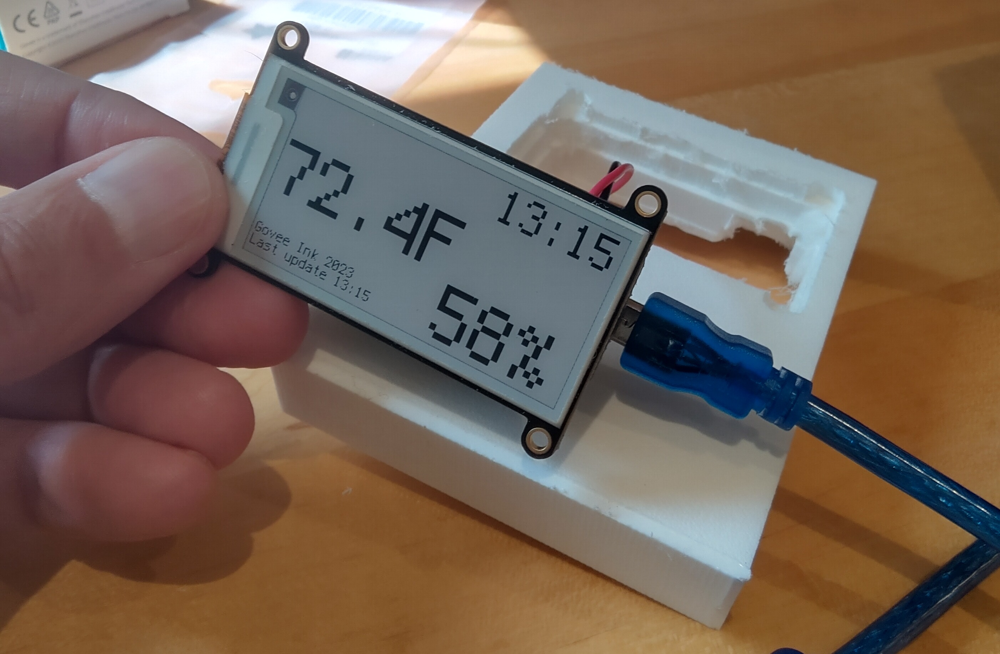

# Govee Ink Display



The Govee Ink Display shows the temperature and humidity from a Govee Bluetooth 5074 sensor on a small e-ink dispkay. 

The hardware is an AdaFruit nrf52840 Feather connected to a 2.13 inch tri-color e-ink FeatherWing display, run either from a small battery or from a USB-C connection (thanks to the built-in USB/battery charge circuity). The case is milled from a small block of plastic. There's a small switch on the side to turn the device on and off. When turned on it will initialize the real-time clock and user preferences for the time display and temperature from a local Bluetooth Current Time Service. 

The purpose of the display is to act as a mini weather station: a person from the inside can look at that display and see the outside temperature (assuming that's where the sensor is).

### Things still to be done and learned

1. DONE Switch the Govee to use the new mini-time slice approach
2. DONE Hook up the BT annunciator
3. DONE Finish the holder + re-mill if desired. Add a switch.
4. DONE What's the power consumption in the different modes?


## Feature 1: Govee 5074 Sensor

The Govee 5074 is a small, battery-powered (but not rechargable 😞) sensor that produced temperature and humidity readings. AS of 2023, it doesn't seem to be on the [Govee](https://us.govee.com/) web site any more.

The sensor reports the temperature and humidity via advertisements -- and in particular, in the advertisement "response".

The full code to read the Govee data is in two files: **Govee5074.py** has the code to parse the advertisements, and **GoveeScanner.py** has the code to look for advertisements. Let's look at the Scanner code first.

The TL/DR: the code scans for advertisements that match our sensor; those are used to match the scan_responses which contain the sensor data. The sensor data is parsed and returned. While this is happening, the annunciator (the blue light) is kept up-t-o-date.

### GoveeScanner.py and the GoveeScanner class

The GoveeScanner class has one main external method: **Scan**, which takes three critical arguments: an annunciator (to report on the current status), a ble radio object which defaults to one from *adafruit_ble.BLERadio()*, and a GOAL_TIME which is time we'll spend waiting for an advertisement. This has a default of 5 seconds which works pretty well.

The **Scan** method calls **ScanOnce** to do the actual scan. This method will scan for up to 0.1 seconds -- by scanning for a very short time, we can update the annunciatar more smoothly.

The **ScanOnce** method calls ble.start_scan to look for adverts. It gets back a generator, which is like a list but data will actually flow in over time. Adverts with a matching name (about line 88) are added to a dict of adverts, indexed by Bluetooth address. Adverts that are scan_responses are checked against the dict; if it matches, it must be a response we're interested in.

The data is pulled out (buffer = advert.data_dict[MANUFACTURER_SECTION])), and that data is used to build a Govee5074 object. If the object is OK, then we've found the data we're looking for and will stop looking. Otherwise, we keep on looking.

All the while we're updating the annunciator.

### Govee5074.py parser

This short (less than 40 line) file has the Govee5074 class. This class is initialized from the Manufacturer section of a Govee 5074 advertisement 
"response". The Govee 5074 data is always 9 bytes long, and contains:
1. The company ID (0xec88) in two bytes
2. Junk (1 byte)
3. The temperature (two bytes)
4. The humidity (two bytes)
5. The battery level as a percent

The unpacking is done with the specialized CircuitPython *struct.unpack()* method with a parameter of **"<HbhhBb"**. The parameter can be decoded as:
1. < means that the data is "little endian" (most Bluetooth LE is little endian), meaning that when we read in a two-byte value like 0xec88, the "88" is in the first byte and "ec" in the next byte.
2. H is for a "half word", which is a fancy way of saying "two bytes". It's capitalized, meaning it's an unsigned value. This value is the company code
3. b is unused
4. h is for the temperature in hundreds of a degree C
5. h is for the humidity in hundreds of a percent
6. B is for the battery level from 0 to 100
7. b is unused

The data is unpacked and put into properties which are used later on to make the display. If the data is all OK, the IsOk field is set to True.

### TL/DR

Call *GoveeScanner.Scan()* to find recent sensor data; it will return a *Govee5074* object (or a None) that has useful fields like "IsOk" to know that the data is all OK and other fields like "temperatureC" and "temperatureF" and "humidity". 

Scan also takes in an annunciator so you can tell what's going on with the scan, and a time value which is the maximum amount of time to wait.

## Feature #2: setting the clock via Bluetooth

The clock will automatically set itself via Bluetooth using the [Simple Bluetooth Time Service](https://apps.microsoft.com/store/detail/simple-bluetooth-current-time-service/9NJQ3TD3K06F?hl=en-us&gl=us) app from the Microsoft store. The same app also sets the preferred units (e.g., temperature in degrees C or F)

### BT Clock setting Code organization

The code is in two files: a class that describes the Current Time Service, (BtCurrentTimeServiceClient.py) and a class that "runs" the Bluetooth (BtCurrentTimeServiceClientRunner.py).

**BtCurrentTimeServiceClient.py** implements what the Python BT libraries need to understand the current time service. It's got the standard "uuid" for the service (0x1805), plus a definition of the most basic form of the current time characteristic (characteristic 0x2A2B). The file also contains the characteristic for the "user unit preferences" which is not part of the Bluetooth standard; it's something I made up to set up the clock with the user preferences for temperature (celcius versus fahrenheit).

**BtCurrentTimeServiceClientRunner.py** is the code that actually scans for the current time service. The important method is the **Scan** call; pass in a ble radio (from ```ble = adafruit_ble.BLERadio()```) plus an optional GOAL_TIME (5 seconds is actually plenty) and whether you want to enable tracing. The code will scan for current time service advertisements 

### Using the Bluetooth CurrentTimeService code (**code.py**)

In *code.py*, look for the *SetupRtcClock* function. This function glues together getting the time from a nearby Bluetooth Current Time Service using the BtCurrentTimeServiceClientRunner's *Scan* method. This returns a service and a connection.

From the service we can pull the current time (we can also get the raw bytes if we don't like how the service parses them into a time.struct_time item) and also the user's unit preferences.

Along the way we're updating the *annunciator* so the user knows what's happening, plus we're actually setting the real-time clock's *datetime* value to set the clock.

And, of course, we close the Bluetooth connection. Overall, this is about 25 lines of code.

### TL/DR for automatic clock setting with Bluetooth

TL/DR: to add automatic clock setting to your nrf52840 CircuitPython project, you just need the two BtCurrentTimeServiceClient*.py files, plus a bit of code in your main code.py file. The clock will be set from app like the "Simple Bluetooth Time Service" program on the Microsoft app store.


## Feature #3: the E-Ink display

I really wanted to try using an e-ink display; I have an e-ink ebook reader and love it. My love for e-ink displays for small projects, however, is now tempered by my practical experience. There were three key shortcomings of the e-ink display:

Firstly, with the Adafruit libraries, you can only update the display every three minutes. This is enforced by the library; refreshing the display too early will throw an exception.

Secondly, the refresh is very intrusive. An update isn't just switching the pixels that need to switch: the entire display will switch from white to black and back again several times first. This is all needed to keep the display from ghosting. 

Lastly, I had any number of issues with making the display update -- eventually I had to redo the display every time I wanted to update. And by "issue" I mean "the labels would be displayed as black rectangles"

### code.py

The e-ink code follows the Adafruit example code for the Featherwing e-ink display. I make the *display_bus* from *displayio.FourWire*; that sets what pins are used and what type of bus the display is connected to. Then I make the *display* from *adafruit_ssd1680.SSD1680*; that makes the display object. Then I call *display.Show()*, passing in the overall clock display group, update the various labels, and call *display.refresh*.

The display is set up twice: it's set up in the initialization code, and then it's reset every 5 minutes when the display is updated. Note that only the display is reset; the label groups and bitmaps don't need to be reset. This works around the display update bug.

The text labels are all set up in the GoveeDisplay.py file (see next section for details); that file also contains the code to update the text labels with new data.

### GoveeDisplay.py

The exact font sizes and layouts are all set up in the **GoveeDisplay.py** file. That file is the "glue" between the data from the sensor and clock to be displayed and the display. It knows how all the labels should be layed out (and does the layout in SetupClockTextGroup).

To use this class, call *MakeDisplayGroup()* with the user preferences (this changes the layout a little bit) and the display width and height. The class is only designed to work with the one 2.13 inch 250x122 [tri-color e-ink display](https://www.adafruit.com/product/4814); if you need this to work with other displays, you will need to change all the layout code, etc.

Call *ShowGovee()* with the userprefs, the Govee sensor, the current time (dt) from the real-time clock and the current voltage. These are all used to update the labels for the display. Note that the display is not refreshed at this time.

If you look at the Python in code.py, the steps above are how the GoveeDisplay class is used. First a single GoveeDisplay is made, and the "mainDisplayGroup" created from calling MakeDisplayGroup. Then ShowGovee is called in two places: first during initialization, and then in the main loop.

The mainDisplayGroup that's created is used in the *display.Show* call, also in two places.

## Feature 4: Battery, Power and Low Power!

A great feature of the NRF52840 is the simple-to-use battery + USB + charge circuit. My device has a dedicated li-on battery (I use one of the Adafruit [350 mAH](https://www.adafruit.com/product/2750) lithium-ion batteries. In normal use, the device isn't connected to USB, and just powers itself from the battery. When I plug in a USB cable, the battery automatically starts to recharge.

Without doing any special work, the power used by the device is about 2.1 mA. Most of the time is just spent in a *time.sleep()*. Normally, the code runs liks this:


### Power and voltage measurements 

To get a good long life out of this device, I need to be able to measure its actual power usage. I use current flow as a proxy for the power draw because my power source is fairly constant.

Measuring current flow is done either with a dedicated ammeter or more commonly with a multimeter set to "mA". All current measurements must be done with the meter "in series" with the power: this means you have to be "interupting" the normal flow of power so that all the power flows through the meter. (Measuring voltage is the other way: you put the meter in parallel) 

For this circuit, you have to measure power flow when on battery and not when the USB is plugged in. I measured the current with a multimeter in "20 mA" mode in series with the battery. This is most easily done at the switch: put one lead on the power-to-device switch terminal, and the other lead on the battery wire. Note that my switch is switching power not ground (the "red" wire). I knew to use the 20 mA mode (my multimeter has a 2 mA, 20 mA, and 200 mA mode) because I started with 200 mA mode, and saw that I was mostly nowhere near 20 mA, but was definitely over 2 mA.

What I measured is that in the main loop, I was drawing **2.1 mA** of current. Except that for a while I saw a power draw of only 1.4 mA. But since then, I've only seen the 2.1 mA draw during the main loop.

Full measurements:
* during the main loop, **2.1 mA**
* while refreshing, **7 mA**
* at start up, the peak is **20 mA**

All these numbers are taken from my better multimeter that wasn't fried during home rennovations in the 90s. But it's still an old bottom-end multimeter. But hey, it's got fresh batteries, so that's something.

Since the li-on battery is 350 mAh, that means I should get about 165 hours of work from the device, or about 7 days.

In theory I can go further: Adafruit has a [deep sleep](https://learn.adafruit.com/deep-sleep-with-circuitpython/power-on-other-boards) where the entire chip is shut down. (there is also a "light sleep" documented in the same place; according to Adafruit docs this mostly uses the same amount of power as a regular time.sleep()). The deep sleep requires more code changes that as of 2023-09-17 I haven't implemented.

Tacking the power usage
|**Day*| **Time** | **Volts** | **volts/time**
|-----|-----|-----|----|
|Sunday|12:20:|4.148|n/a
|Sunday|17:30|4.08|
|Sunday|19:55|4.05
|Monday|08:40|3.99
|Monday|21:20|3.89
|Tuesday|8:30|3.64
|Tuesday|18:30|3.6
|Wednesday|9:00|3.54
|Thursday|20:30|3.48
|Friday|8:45|3.38
|Friday|14:45|3.38|Battery is dead

## The Build: Picking components

I'm using the Adafruit [nrf52840 Feather](https://www.adafruit.com/product/4062) with Bluetooth; it's a recent version of the control. For the display I'm using the 2.13 inch 250x122 [tri-color e-ink display](https://www.adafruit.com/product/4814). A critical design constraint is that the e-ink display much not be refreshed more than about once every 3 minutes. I might well set it up as a mini-clock with a 5-minute granularity, so I'll try a refresh every 5 minutes.

Why these? Why not, e.g., the Clue device? The short answers are: I've always wanted to try using the e-ink displays, and the nrf52840 has better battery circuitry (notably, you can have a battery and just plug in USB to recharge). Additionally, an earlier project that used the Clue had real problems with power draw: after lots of work, I reduced the power draw of a Clue from 50 mA to 45 mA. That's not much of a difference.

For a battery, I picked the [350 mAH](https://www.adafruit.com/product/2750) lithium-ion battery from Adafruit. The key design choice here was "something that is known to be compatible with the nrf52840". Many batteries might also have worked, but it's nice to know that this one will definitely work. I know just enough electrical engineering to know that a battery fire is 100% not on bucket list of things to ever experience! (source: a degree in electrical engineering).

Other components: a small switch, a block of plastic from which I milled out space for the components, and a short bit of wire. The wire is a cool story: I found a 25 foot long 100-wire phone conductor in a dumpster when I was a first year at college. I've been using bits of that wire ever since! In this case, I picked a short bit of orange wire. The switch is just an DPST (double pole/single throw) switch. I would have used a SPST switch, but wierdly didn't have on in my box of switches. 

## Blog posts, youtube videos, PRs

### Blogs:

1. Update old clock blog with link to github


[Code on Github](https://github.com/pedasmith/ElectronicsProjects/tree/main/2023-Adafruit-Python-InkGoveeListener)


### Code PRs:
1. Incorrect numerical value for sleep 120, not 180
2. Should use the time_to_refresh from the adafruit_ssd1680.SSD1680


Code bugs and code bug sample:

https://docs.circuitpython.org/projects/ssd1680/en/latest/index.html
1. time.sleep(120)


Examples are pulled from GitHub:
https://github.com/adafruit/Adafruit_CircuitPython_SSD1680/tree/main/examples

There's four files

No issues:
https://github.com/adafruit/Adafruit_CircuitPython_SSD1680/blob/main/adafruit_ssd1680.py


### Improvements for the E-Ink sample code

The Adafruit e-ink sample code has a big problem and a small problem. The big problem is that their example has a weird extensability problem: you can easily add a label to the example, but updating the label causes weird corruption issues (and in particular: the updated label will be drawn all black).

The sample code from Adafruit is listed below.

The small problem is that the code does an incorrectly sized ```timesleep(120)```. This is actually wrong in two ways: the documentation says to wait for three minutes, which is 180 seconds. And the right way is to use the display's **time_to_refresh** values like this: ```time.sleep(display.time_to_refresh + 5)```.

Why add 5 seconds? Because certainly other systems aren't very accurate with their sleep times and can sleep for either less or more time than requested. Since sleeping too little is disaster for this case, it's easiest to simply sleep a little more.

The root cause of the big problem is that when you update a label, the display can only deal with text that's at least 7 characters long. Seriously, I've tried this multiple times, and in multiple ways. Text that is 1 to 5 characters long will be displayed as a black box. Text which is 6 characters long will display with a red background (!), except for a thick black bar under the latters. And text that's 7 characters or longer displays perfectly.


**The following was my old understanding. It's completely wrong**
The root cause of the big problem is the lifetime of the background bitmap. The bitmap is a [displayio.OnDiskBitmap](https://docs.circuitpython.org/en/latest/shared-bindings/displayio/#displayio.OnDiskBitmap) or [here](https://learn.adafruit.com/circuitpython-display-support-using-displayio/display-a-bitmap), initialized with a file like this: ```pic = displayio.OnDiskBitmap(f)```. Note that it's taking in a file, not a string which is a path to a file. The file is opened using a with statements: ```with open("/display-ruler.bmp", "rb") as f:```. The lifetime of the file, and therefore the useable lifetime of the OnDiskBitmap, is just the indented code. The failure looks surprising -- the label is drawn all black!

You'll probably update the label somewhere that isn't in the indented code under the ```with open``` statement. When you go to refresh the display, the bitmap will no longer work correctly. But the result isn't that the bitmap doesn't display; what will happen is the label is drawn in black! 

There are a few solutions. The easiest is pointed out in the samples for the OnDiskBitmap: just make an OnDiskBimaps using the file path, not an opened file object: ```pic = displayio.OnDiskBitmap("/display-ruler.bmp")```. Once you do this, the project works perfectly.

#### Original sample code from Adafruit
```Python
# SPDX-FileCopyrightText: 2017 Scott Shawcroft, written for Adafruit Industries
# SPDX-FileCopyrightText: Copyright (c) 2021 Melissa LeBlanc-Williams for Adafruit Industries
#
# SPDX-License-Identifier: Unlicense

"""Simple test script for 2.13" 250x122 tri-color display.
Supported products:
  * Adafruit 2.13" Tri-Color eInk Display Breakout
    * https://www.adafruit.com/product/4947
  * Adafruit 2.13" Tri-Color eInk Display FeatherWing
    * https://www.adafruit.com/product/4814
  * Adafruit 2.13" Mono eInk Display FeatherWing
    * https://www.adafruit.com/product/4195


"""

import time
import board
import displayio
import adafruit_ssd1680

displayio.release_displays()

# This pinout works on a Metro M4 and may need to be altered for other boards.
spi = board.SPI()  # Uses SCK and MOSI
epd_cs = board.D9
epd_dc = board.D10
epd_reset = board.D8  # Set to None for FeatherWing
epd_busy = board.D7  # Set to None for FeatherWing

display_bus = displayio.FourWire(
    spi, command=epd_dc, chip_select=epd_cs, reset=epd_reset, baudrate=1000000
)
time.sleep(1)

# For issues with display not updating top/bottom rows correctly set colstart to 8
display = adafruit_ssd1680.SSD1680(
    display_bus,
    colstart=1,
    width=250,
    height=122,
    busy_pin=epd_busy,
    highlight_color=0xFF0000,
    rotation=270,
)


g = displayio.Group()

with open("/display-ruler.bmp", "rb") as f:
    pic = displayio.OnDiskBitmap(f)
    # CircuitPython 6 & 7 compatible
    t = displayio.TileGrid(
        pic, pixel_shader=getattr(pic, "pixel_shader", displayio.ColorConverter())
    )
    # CircuitPython 7 compatible only
    # t = displayio.TileGrid(pic, pixel_shader=pic.pixel_shader)
    g.append(t)

    display.show(g)

    display.refresh()

    print("refreshed")

    time.sleep(120)
```


#### Links for E-Ink improvements

* The original [Adafruit example](https://github.com/adafruit/Adafruit_CircuitPython_SSD1680/blob/main/examples/ssd1680_simpletest.py) code. Note that it's a CircuitPython sample for the SSD1680 display

### Libraries and Links

The [Simple Bluetooth Current Time Service](https://apps.microsoft.com/store/detail/simple-bluetooth-current-time-service/9NJQ3TD3K06F?hl=en-us&gl=us) app runs on a Windows computer and broadcasts out the current date and time over Bluetooth. This is the app I use to set the clock on the device. 

Specification for the [Current  Time Service](https://www.bluetooth.com/specifications/specs/current-time-service-1-1/) are on the Bluetooth SIG site.


The e-ink uses the **SSD1680** chipset. There's a [learn](https://learn.adafruit.com/adafruit-2-13-eink-display-breakouts-and-featherwings) path, but beware! the path is written for a bunch of different devices at once; you have to keep track of which is which. The [CircuitPython](https://learn.adafruit.com/adafruit-2-13-eink-display-breakouts-and-featherwings/circuitpython-usage) stuff is fiarly far into the learning path.

The display uses digital pins 5, 6, 9, 10. It also uses the SPI, but that's a shared resource.

Available pins are the digital 11, 12, 13, plus D2. Analog pins A0 to A5 are available (but isn't one used for the battery voltage?)

Use the **adafruit_ssd1680.mpy** library file.

Adafruit [nrf52840](https://learn.adafruit.com/introducing-the-adafruit-nrf52840-feather/circuitpython-pins-and-modules) CircuitPython info

[350 mAH](https://www.adafruit.com/product/2750) lithium-ion battery from Adafruit.

The [Govee 5074](https://us.govee.com/) doesn't seem to be mentioned on the Govee site. Luckily there are still mentions on github, etc.